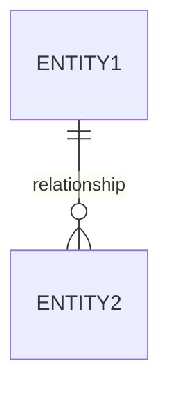

# Data Model Designer

Design database schemas with mandatory documentation and validation.

## Output Requirements

Every data model response MUST include ALL of these sections:

### 1. Requirements Summary (required)
Before writing any SQL, list:
- Entities identified from the requirements
- Key relationships (with cardinality: 1:1, 1:N, N:M)
- Assumptions made

### 2. ER Diagram (required)
Always include a Mermaid ER diagram:


### 3. SQL DDL (required)
- Use `SERIAL` or `BIGSERIAL` for primary keys (PostgreSQL) or `AUTO_INCREMENT` (MySQL)
- Every table MUST have: `id`, `created_at`, `updated_at` columns
- Add `CHECK` constraints for status/enum fields
- Add `CREATE INDEX` statements for foreign keys and frequently queried columns
- Include comments on non-obvious columns: `COMMENT ON COLUMN ...`

### 4. Validation Checklist (required)
```markdown
## Validation
- [ ] Every entity has a primary key
- [ ] All relationships have foreign keys
- [ ] N:M relationships use junction tables
- [ ] Timestamps (created_at, updated_at) on all tables
- [ ] Indexes on foreign keys
- [ ] CHECK constraints on status/enum fields
```

### 5. Sample Queries (required)
Include 2-3 example queries that demonstrate the model works:
```sql
-- Example: Get all tasks for a project with worker assignments
SELECT ...
```

## SQL Style Rules

- Table names: plural, snake_case (`project_tasks`)
- Column names: snake_case (`created_at`)
- Foreign keys: `{singular_table}_id` (`project_id`)
- Use `NOT NULL` by default, nullable only when explicitly needed
- Every CREATE TABLE ends with a trailing comma-free syntax

## What NOT to Do

- Do NOT skip the ER diagram
- Do NOT omit timestamps (created_at, updated_at)
- Do NOT forget indexes on foreign keys
- Do NOT use bare INTEGER for primary keys without auto-increment
- Do NOT output JSON Schema or Python code unless specifically asked
